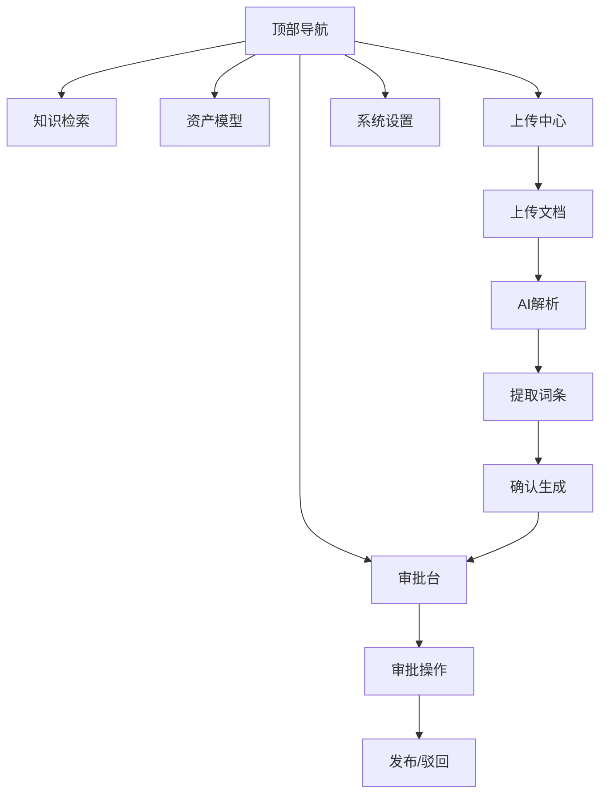

# 知识资产中台 - 产品需求文档

## 1. 产品概述

知识资产中台是一个面向金融机构的知识管理平台，用于管理信贷政策、风险管理、合规制度等领域的知识资产。支持知识检索、资产模型配置、文档上传与AI解析、审批流程及系统设置等核心功能。

## 2. 核心功能

### 2.1 用户角色
| 角色 | 说明 | 核心权限 |
|------|------|----------|
| 管理员 | Admin | 系统设置、用户权限管理 |
| 编辑者 | 李专员等 | 知识编辑、提交审批 |
| 审批人 | 张经理、王主管等 | 知识审批、发布 |

### 2.2 功能模块
1. **知识检索**: 全局搜索、筛选条件、结果列表
2. **资产模型**: 领域管理、实体类型、词条分类、属性模板、关联关系、标准口径
3. **上传中心**: 文件上传、AI解析任务、待生成词条、待更新知识
4. **审批台**: 知识审批、版本对比、历史记录
5. **系统设置**: 通用设置、用户权限、审批流程配置、知识模型同步、API接入、日志审计

### 2.3 页面详情
| 页面名称 | 模块名称 | 功能描述 |
|----------|----------|----------|
| 知识检索 | 搜索页 | 顶部搜索框、筛选面板、结果列表展示 |
| 资产模型-领域管理 | 模型配置 | 统计卡片、领域列表表格、分页 |
| 上传中心-AI解析 | 上传中心 | 文件拖拽上传、解析任务展示、词条提取、属性预览 |
| 审批台-详情 | 审批台 | 知识详情、审批操作、关联资产、审批历史 |
| 系统设置-通用 | 设置菜单 | 站点信息、通知设置、审批流配置、数据保留策略 |

## 3. 核心流程

用户通过顶部导航切换五大模块：
- **知识检索**: 输入关键词 → 筛选条件 → 查看结果 → 进入详情
- **资产模型**: 配置领域/实体/分类等基础数据 → 管理知识资产结构
- **上传中心**: 上传文档 → AI自动解析 → 提取词条 → 确认生成
- **审批台**: 查看待审知识 → 审批操作（通过/驳回/打回修正）→ 发布
- **系统设置**: 配置站点、权限、流程、同步、API等

## 4. 用户界面设计

### 4.1 设计风格
- **主色调**: 蓝色系 `#2563eb` 为主色，用于导航激活、按钮、链接
- **辅助色**: 绿色 `#22c55e`（已启用/通过）、橙色 `#f59e0b`（待完善/待审批）、红色 `#ef4444`（驳回）
- **背景色**: 浅灰 `#f8fafc`（页面背景）、白色 `#ffffff`（卡片）
- **按钮样式**: 圆角 `border-radius: 6px`，主按钮蓝色填充，次按钮白色边框
- **字体**: 系统默认无衬线字体，中文优先
- **布局**: 顶部导航 + 左侧边栏 + 主内容区
- **图标**: lucide-react 图标库

### 4.2 页面设计概览

#### 页面1: 知识检索
- **顶部搜索区**: 居中搜索框，带放大镜图标，占位文字"搜索词条..."
- **筛选面板（左侧）**: 
  - 所属领域: 复选框列表（信贷政策45、风险管理32、合规制度28、普惠金融23）
  - 知识类型: 词条68、制度文件35、政策解读18、研究报告7
  - 更新时间: 最近一周、最近一月、最近一年
  - 热门标签: 贷款、风控、普惠、绿色金融
- **结果列表（右侧）**: 
  - 顶部标签筛选: 词条、制度、政策
  - 排序: 相关度排序
  - 每条结果: 标题（蓝色链接）+ 类型标签 + 状态标签 + 摘要 + 元信息（领域·版本·日期·相关度）

#### 页面2: 资产模型-领域管理
- **左侧边栏**: 模型配置菜单（领域管理、实体类型、词条分类、属性模板、关联关系、标准口径）
- **主内容区**:
  - 标题区: "领域管理" + 描述"定义知识资产的顶层分类领域" + 搜索框 + "新建领域"按钮
  - 统计卡片: 总领域数12（蓝色）、已启用10（绿色）、待完善2（橙色）
  - 数据表格: 领域名称、领域编码、负责人、状态（标签）、最后更新时间
  - 分页: `< 1 2 3 >`

#### 页面3: 上传中心-AI解析工作台
- **左侧边栏**: 上传中心菜单（文件上传、AI解析任务、待生成词条、待更新知识）
- **主内容区**:
  - 标题: "AI解析工作台" + 描述"上传专业文档，AI自动拆解生成结构化知识"
  - 上传区域: 虚线边框拖拽区，提示"拖拽文件到此处，或点击上传"，支持PDF/Word/Markdown/TXT
  - 解析任务卡片: 
    - 文件名、文件大小、上传时间、解析状态（解析完成-绿色）
    - 原文摘要
    - AI提取待生成词条列表（带复选框）
    - 属性自动填充预览（适用对象、生效日期、政策来源）
    - 底部按钮: 确认生成词条（蓝色）、重新解析（白色）、放弃（灰色）

#### 页面4: 审批台-知识详情
- **面包屑**: 首页 / 信贷政策 / 小微企业贷款额度政策
- **左侧内容区**:
  - 标题: 词条名称 + 状态标签（待审批-橙色）
  - 元信息: 版本v2.3 · 最后更新 · 编辑者
  - 操作按钮: 编辑、版本对比、历史记录
  - 内容区块: 定义概述、适用对象与范围（列表）、核心规则与标准（表格）、关联政策文件（链接列表）
- **右侧边栏**:
  - 审批操作: 当前审批人、提交时间
  - 审批意见输入框
  - 操作按钮: 通过并发布（绿色）、驳回（红色）、打回修正（橙色）
  - 关联资产列表
  - 审批历史时间线

#### 页面5: 系统设置-通用设置
- **左侧边栏**: 设置菜单（通用设置、用户权限、审批流程配置、知识模型同步、API接入、日志审计）
- **主内容区**:
  - 站点信息: 站点名称输入框、站点Logo上传区
  - 知识更新通知: 三个开关（词条更新通知审批人、审批状态变更通知提交人、新词条发布通知订阅用户）
  - 默认审批流配置: 审批节点（初审→复审→终审）、自动超时72小时
  - 数据保留策略: 历史版本保留最近10个、回收站30天后自动清理
  - 底部按钮: 保存设置（蓝色）、重置（白色）

### 4.3 响应式设计
- 桌面端优先设计（1280px+）
- 左侧边栏固定宽度 240px
- 主内容区自适应填充剩余空间
- 移动端隐藏侧边栏，使用汉堡菜单

### 4.4 公共组件
- **顶部导航栏**: 左侧Logo+产品名"知识资产中台"，右侧导航链接（知识检索、资产模型、上传中心、审批台、系统设置）+ 通知图标 + 用户头像/名称
- **左侧边栏**: 分组标题 + 菜单项（图标+文字），激活项蓝色背景
- **状态标签**: 已启用（绿底绿字）、待完善（橙底橙字）、待审批（橙底橙字）、解析完成（绿底绿字）
- **按钮**: 主按钮（蓝底白字）、次按钮（白底灰边）、危险按钮（红底白字）、成功按钮（绿底白字）
- **卡片**: 白色背景、圆角、阴影、内边距24px
- **表格**: 表头灰色背景、行分隔线、hover效果
