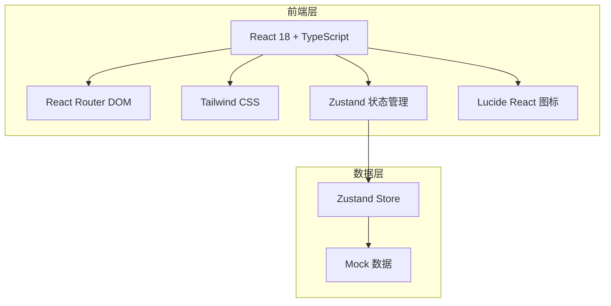

# 知识资产中台 - 技术架构文档

## 1. 架构设计



## 2. 技术选型

- **前端框架**: React 18 + TypeScript
- **构建工具**: Vite
- **路由**: React Router DOM v6
- **样式**: Tailwind CSS
- **状态管理**: Zustand
- **图标**: Lucide React
- **数据**: 前端 Mock 数据（无后端）

## 3. 路由定义

| 路由 | 页面 | 说明 |
|------|------|------|
| / | 知识检索 | 默认首页，搜索与结果展示 |
| /asset-model | 资产模型-领域管理 | 模型配置主页面 |
| /upload | 上传中心-AI解析 | 文件上传与解析工作台 |
| /approval | 审批台-知识详情 | 审批详情页面 |
| /settings | 系统设置-通用 | 通用设置页面 |

## 4. 项目结构

```
src/
├── components/          # 公共组件
│   ├── Layout.tsx       # 整体布局（导航+侧边栏）
│   ├── TopNav.tsx       # 顶部导航
│   ├── Sidebar.tsx      # 左侧边栏
│   ├── StatusTag.tsx    # 状态标签组件
│   └── StatCard.tsx     # 统计卡片
├── pages/               # 页面组件
│   ├── SearchPage.tsx      # 知识检索
│   ├── AssetModelPage.tsx  # 资产模型
│   ├── UploadPage.tsx      # 上传中心
│   ├── ApprovalPage.tsx    # 审批台
│   └── SettingsPage.tsx    # 系统设置
├── store/               # Zustand 状态管理
│   └── index.ts
├── data/                # Mock 数据
│   └── mockData.ts
├── App.tsx              # 根组件
└── main.tsx             # 入口文件
```

## 5. 组件设计

### 5.1 Layout 布局组件
- Props: `sidebarMenu`（侧边栏菜单项）、`activeMenu`（当前激活项）
- 组合 TopNav + Sidebar + 主内容区

### 5.2 状态管理（Zustand）
```typescript
interface AppState {
  currentNav: string;        // 当前顶部导航
  currentSidebarMenu: string; // 当前侧边栏菜单
  setCurrentNav: (nav: string) => void;
  setCurrentSidebarMenu: (menu: string) => void;
}
```

### 5.3 数据模型

#### 领域（Domain）
```typescript
interface Domain {
  id: string;
  name: string;
  code: string;
  owner: string;
  status: 'enabled' | 'pending';
  updatedAt: string;
}
```

#### 知识条目（KnowledgeItem）
```typescript
interface KnowledgeItem {
  id: string;
  title: string;
  type: '词条' | '制度文件' | '政策解读' | '考核指标';
  status: '待审批' | '已发布';
  domain: string;
  version: string;
  updatedAt: string;
  relevance: number;
  summary: string;
}
```

#### 审批记录（ApprovalRecord）
```typescript
interface ApprovalRecord {
  id: string;
  action: string;
  operator: string;
  time: string;
  status: 'completed' | 'pending';
}
```

## 6. 样式规范

### 6.1 颜色变量（Tailwind）
- 主色: `blue-600` (#2563eb)
- 成功: `green-500` (#22c55e)
- 警告: `amber-500` (#f59e0b)
- 危险: `red-500` (#ef4444)
- 背景: `slate-50` (#f8fafc)
- 卡片: `white` (#ffffff)
- 边框: `slate-200` (#e2e8f0)

### 6.2 间距规范
- 页面内边距: 24px
- 卡片内边距: 24px
- 卡片间距: 16px
- 表格行高: 56px

### 6.3 圆角规范
- 卡片: 8px
- 按钮: 6px
- 标签: 4px
- 输入框: 6px
